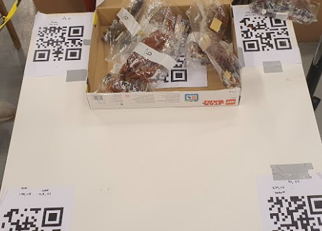

<h1>Overview</h1>
Each test were performed five times at three arbitrary locations. 
Below are each location grouped together and sorted numerically.

<h1> Images for position 1 </h1>

 
 
 <figcaption>Fig.1.1 - First throw, location number one.</figcaption>
     

 
 <figcaption>Fig.1.2 - Second throw, location number one.</figcaption>

 
 <figcaption>Fig.1.3 - Third throw, location number one.</figcaption>

 
 <figcaption>Fig.1.4 - Fourth throw, location number one.</figcaption>

 
 <figcaption>Fig.1.5 - Fifth throw, location number one.</figcaption>

<h1> Images for position 2 </h1>

                    
 
 
 
 

<h1> Images for position 3 </h1>

                    
 
 
 
 

