<h1>LEGO Cloud-Rider test</h1>
Each LEGO box were tested with five throws at three arbitrary locations.
Below are each location grouped together and sorted numerically.

<h1> Images for throwing location one </h1>

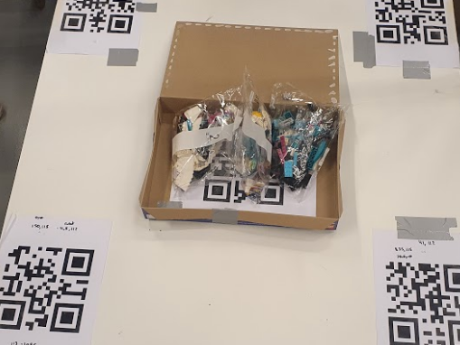
 
 <figcaption>Fig.1.1 - First throw, location number one.</figcaption>
     

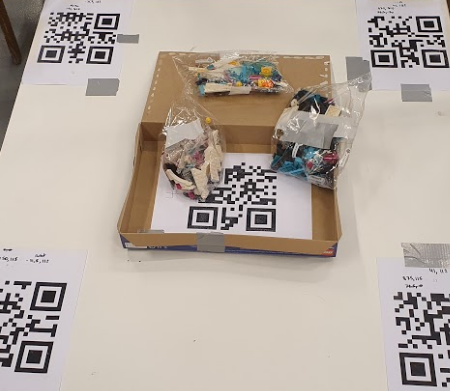
 
 <figcaption>Fig.1.2 - Second throw, location number one.</figcaption>
     

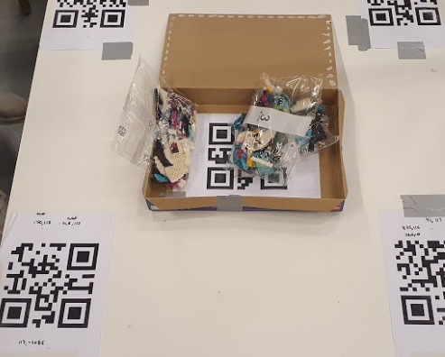
 
 <figcaption>Fig.1.3 - Third throw, location number one.</figcaption>
     

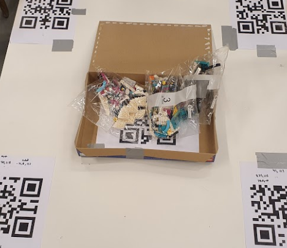
 
 <figcaption>Fig.1.4 - Fourth throw, location number one.</figcaption>
     

 
 <figcaption>Fig.1.5 - Fifth throw, location number one.</figcaption>
     

<h1> Images for throwing location two </h1>

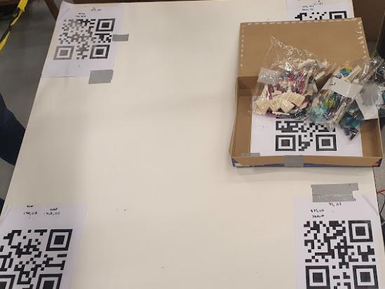
 
 <figcaption>Fig.2.1 - First throw, location number two.</figcaption>
     

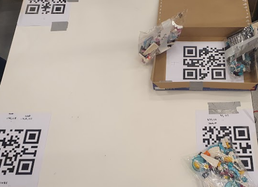
 
 <figcaption>Fig.2.2 - Second throw, location number two.</figcaption>
     

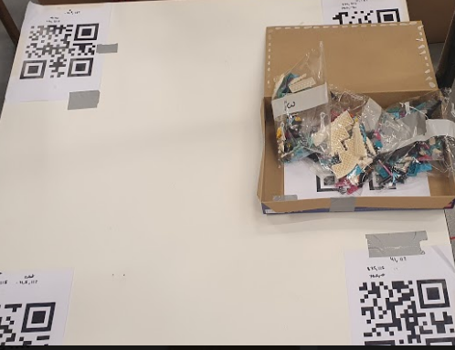
 
 <figcaption>Fig.2.3 - Third throw, location number two.</figcaption>
     

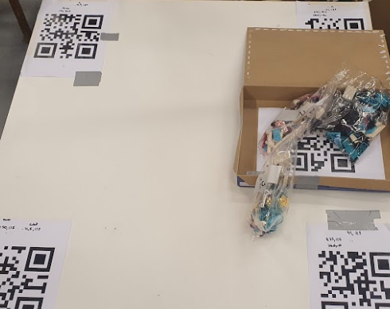
 
 <figcaption>Fig.2.4 - Fourth throw, location number two.</figcaption>
     

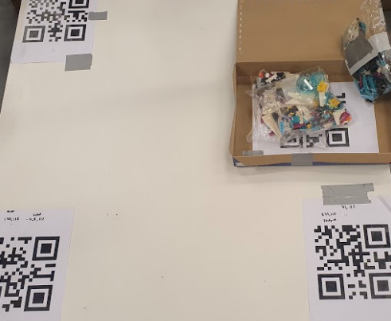
 
 <figcaption>Fig.2.5 - Fifth throw, location number two.</figcaption>
     

<h1> Images for throwing location three </h1>

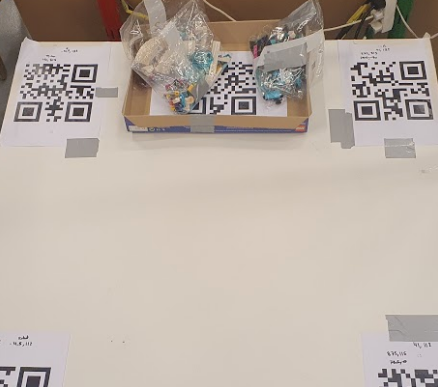
 
 <figcaption>Fig.3.1 - First throw, location number three.</figcaption>
     

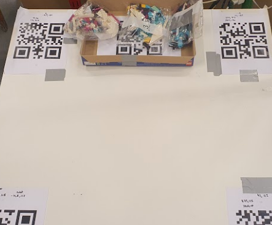
 
 <figcaption>Fig.3.2 - Second throw, location number three.</figcaption>
     

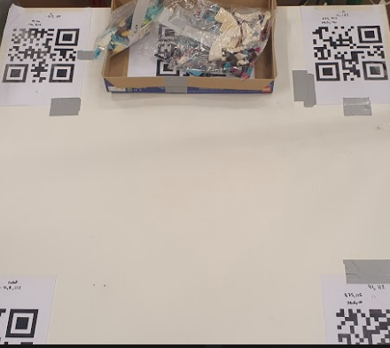
 
 <figcaption>Fig.3.3 - Third throw, location number three.</figcaption>
     

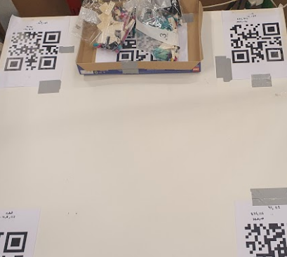
 
 <figcaption>Fig.3.4 - Fourth throw, location number three.</figcaption>
     

